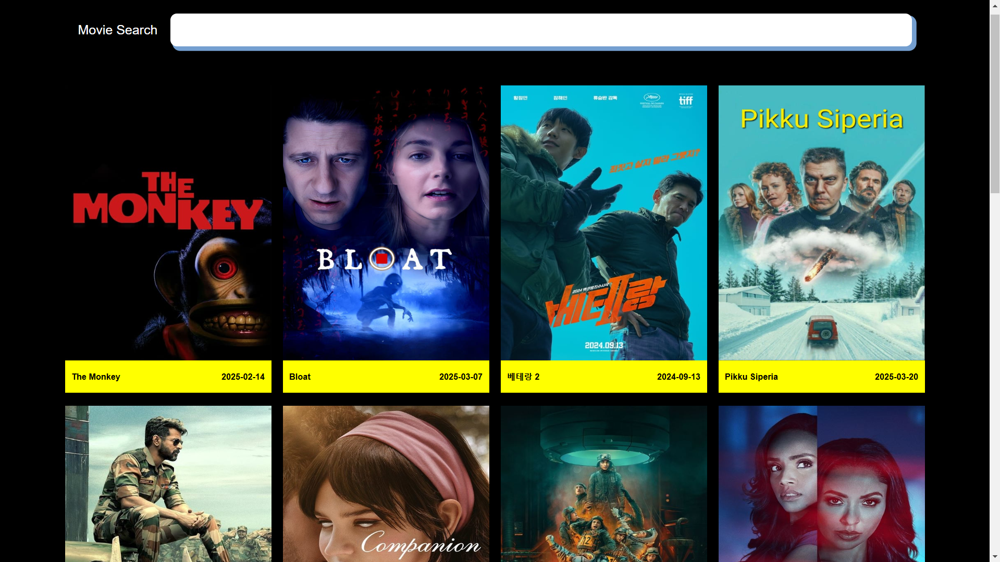

# Movie4U

Movie4U is a web application that allows users to search for movies and view popular movie listings using The Movie Database (TMDb) API.

## Features
- Search for movies by title.
- View popular movies on page load.
- Responsive design for mobile and desktop.

## Website Preview


## Technologies Used
- HTML
- CSS (with responsive design)
- JavaScript (with async/await for API calls)
- TMDb API

## Installation
1. Clone the repository:
   ```bash
   git clone https://github.com/VirendraSah/Movie4U.git
   ```
2. Navigate to the project directory:
   ```bash
   cd Movie4U
   ```
3. Open `index.html` in your browser.

## Usage
1. On page load, popular movies are displayed.
2. Use the search bar to find movies by title.
3. The app dynamically loads and displays search results.

## File Structure
- `index.html` - The main HTML file.
- `style.css` - Styles for the app.
- `responsive.css` - Responsive design rules.
- `script.js` - Handles fetching movie data and updating the UI.
- `images/` - (Optional) Directory for storing image assets.

## API Integration
- Fetches popular movies from:
  ```
  https://api.themoviedb.org/3/movie/popular?api_key=YOUR_API_KEY&language=hi-IN&page=2
  ```
- Searches movies by title from:
  ```
  https://api.themoviedb.org/3/search/movie?&api_key=YOUR_API_KEY&page=1&query=SEARCH_TEXT
  ```
  Replace `YOUR_API_KEY` with your TMDb API key.

## Contributing
1. Fork the repository.
2. Create a new branch:
   ```bash
   git checkout -b feature-name
   ```
3. Make your changes and commit:
   ```bash
   git commit -m 'Add new feature'
   ```
4. Push to your fork and create a pull request.

## License
This project is licensed under the MIT License.

## Acknowledgements
- [The Movie Database (TMDb)](https://www.themoviedb.org/)

## Author
- [Virendra Sah](https://github.com/VirendraSah)

